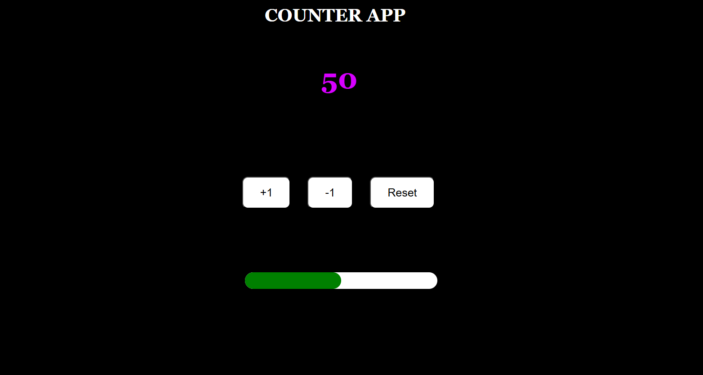

# 🚀 React Counter App

A fun and interactive counter application built with React! Simple, intuitive, and perfect for beginners learning React state management. 🧑‍💻🔥

## 🎯 Features
- ➕ Increment and ➖ decrement the counter
- 🔄 Reset the counter to zero
- 💡 Smooth and responsive UI for a seamless experience

## 🛠️ Technologies Used
- ⚛️ **React** (useState Hook for state management)
- 💻 **JavaScript** (ES6+ features for clean and efficient code)
- 🎨 **CSS** (for a stylish and minimal design)
- 📄 **HTML** (for structured content)

## 🚀 Getting Started

1. **Clone the repository:**
   git clone https://github.com/your-username/react-counter-app.git

2. Navigate to the project directory:    
   cd react-counter-app

3. Install dependencies:
   npm install

4. Start the development server:
   npm start

5. Open your browser and visit:
   http://localhost:3000

## 🎨 Screenshots

## 🤝 Contributing
Excited to improve this project? Fork the repository, create a feature branch, and open a pull request. Every contribution helps make it better! 🚀✨

Happy coding! 🚀😃

